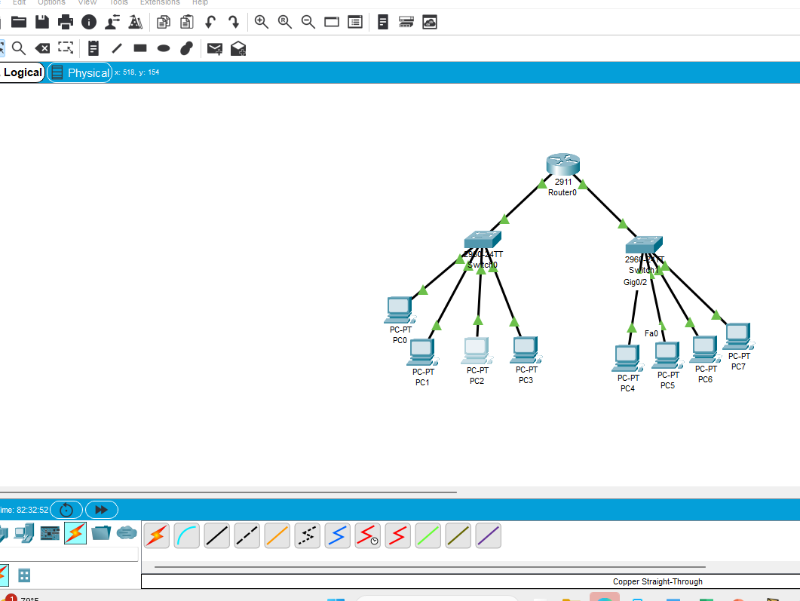
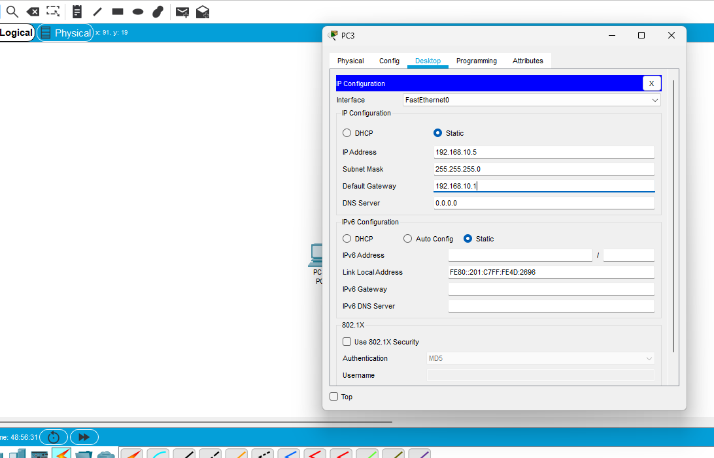
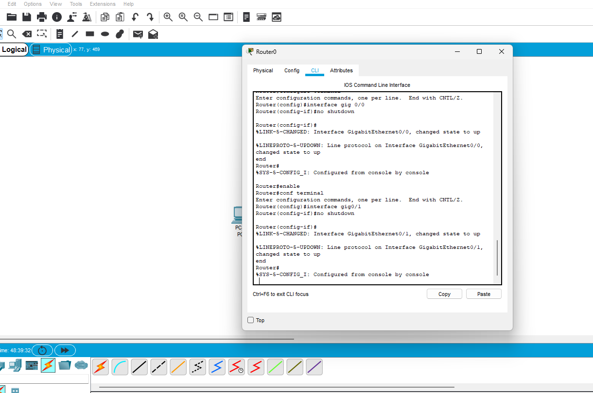
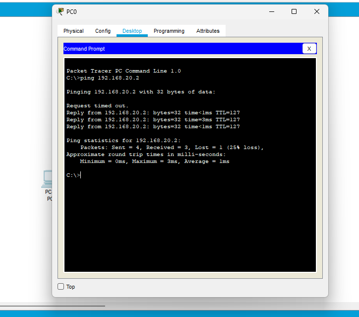
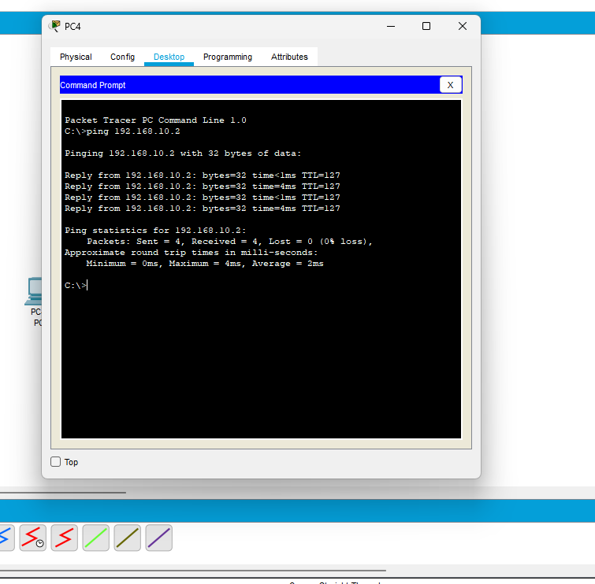

## Project Evidence

The project evidence below documents the network topology, IP configuration, router configuration, and connectivity testing performed during the project.

### 1. Network Topology

The completed network topology consists of one router, two switches, and eight PCs.

### 2. IP Configuration

Example of static IP configuration on a network device.

### 3. Router Configuration

Router interface configuration and verification using the Cisco IOS command line.

### 4. Connectivity Test – Packet Loss

A connectivity test to `192.168.20.2` initially showed 3 packets received and 1 packet lost (25% packet loss).

### 5. Connectivity Test – Successful

A final connectivity test to `192.168.10.2` showed successful communication with 4 packets received and 0 packets lost (0% packet loss).

